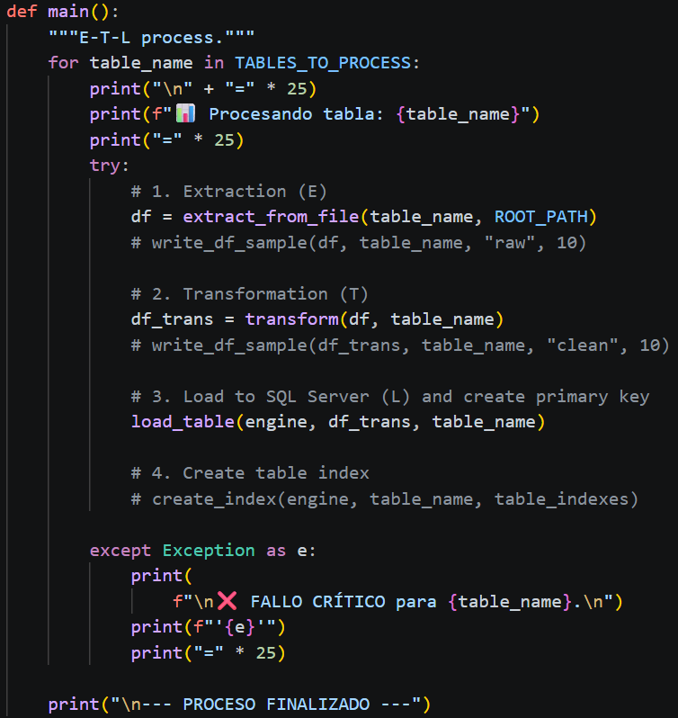

# ETL-SIGER
ETL process using Polars, where DataFrames (tables) are obtain from csv files.

Main script calls 'extract.py' to obtain the DataFrames corresponding to the tables, then 'transform.py' script is called to clean the data and to convert the columns into the correct format. Finally, 'load.py' is called to load every table to SQL Server, to create primary keys and to create table indexes.

## 🌎 Repository Structure
```
ETL-SIGER/
├── main.py
├── .gitignore
├── env/                # Virtual enviroment (not provided)
└── requirements.txt
└── pkg                 # Contains all needed files (Python package)
    └── __init__.py     # Specifies that folder 'pkg' is a Python package
    └── extract.py      # Contains all functions related to extraction process
    └── transform.py    # Contains all functions related to transform process
    └── load.py         # Contains all functions related to load process
    └── globals.py      # Contains all global variables
    └── config.py       # Contains all configuration params
    └── .env            # Contains all secret data (not provided)
```


## ✨ Details
Consider the following:

*In 'extract.py', the file is read all at the same time. If the file is too long, the file should be read by batches (chunks), as shown in:
https://github.com/departamentoIA/ETL-SAT-NOMINAS/tree/main

*In 'load.py', before loading the table, the corresponding SQL table in 'SQL Server' is created (by using SQL commands) according to the type of every column, as shown in Fig. 1 and Fig. 2. Primary keys are also created.


Fig. 1.


Fig. 2.

All tables are loaded by batches, as shown in Fig. 3. Finally, table indexes are created.

Fig. 3.

*In 'main.py', all tables are processed one by one, as shown in Fig. 4. Notice that this project is modular, this is, every module can be changed and the rest of code is not affected.

Fig. 4.

## 🚀 How to run locally
1. Clone this repository:
```
git clone https://github.com/departamentoIA/ETL-SIGER.git
```
2. Set virtual environment and install dependencies.

For Windows:
```
python -m venv env
env/Scripts/activate
pip install -r requirements.txt
```
For Linux:
```
python -m venv env && source env/bin/activate && pip install -r requirements.txt
```
3. Create your ".env" file, which has the following form:
```
DB_SERVER=10.0.00.00,5000
DB_NAME=My_DataBase
DB_USER=caarteaga
DB_PASSWORD=pa$$word
```
4. Run "main.py".